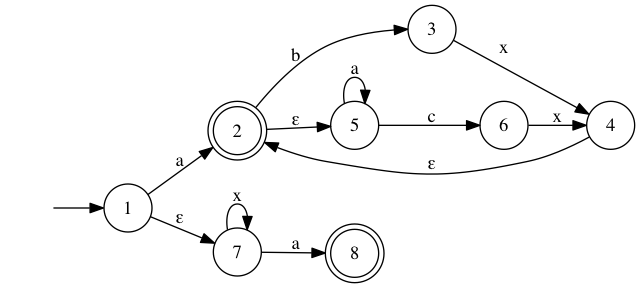
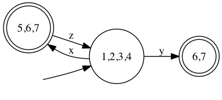

### Homework 1 

#### 13307130167 刘阳

#### 2.3a

Match all 4-length {'0', '1'} binary string  EXCEPT '0110'

#### 2.4b

 

#### 2.5a

 

#### 2.6

| Pair   | state1 | state2 | state3 | state4 | state5 | state6 | state7 | state8 |
| ------ | ------ | ------ | ------ | ------ | ------ | ------ | ------ | ------ |
| state1 |        | ine    | ine    | ine    | equ    | ine    | ine    | ine    |
| state2 |        |        | ine    | ine    | ine    | ine    | ine    | equ    |
| state3 |        |        |        | ine    | ine    | ine    | ine    | ine    |
| state4 |        |        |        |        | ine    | equ    | ine    | ine    |
| state5 |        |        |        |        |        | ine    | ine    | ine    |
| state6 |        |        |        |        |        |        | ine    | ine    |
| state7 |        |        |        |        |        |        |        | ine    |

*PS*: 

**ine**: inequivalent states

**equ**: equivalent states

Use the general algorithm for minimizing finite automata, there are three pairs of inequivalent states: **(1, 5), (2, 8), (4, 6)**

#### Additional Question: Use regular expression to describe comment in Java

`"/"("/".*"\n" | ("*"+.*"\n")+"*/")`

