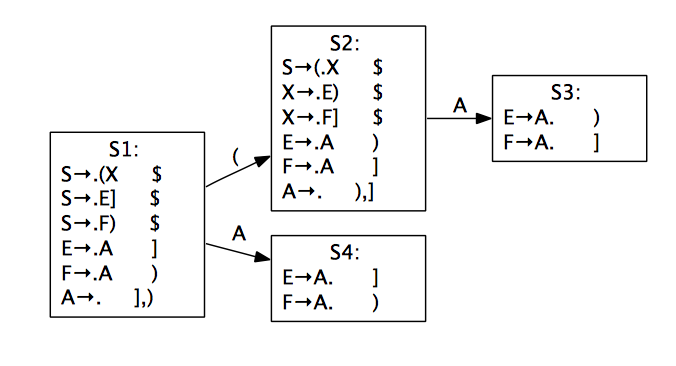

### Homework 2

#### 13307130167 刘阳

#### 3.4

```
S -> S ; S			E -> E + E
```

是有歧义的文法。

```
S -> S ; S			E -> E + E		L -> L , E
```

是左递归文法。

所以：

1. 消除歧义

   ```
   S -> S ; F		S -> F		F -> print(L)
   F -> id := E	E -> E + T		
   E -> T			T -> num	T -> id
   T -> (S, E)		L -> E		L -> L, E
   ```

2. 消除左递归

   ```
   S -> F S'		S' -> ; F S'	S' ->
   F -> print(L)	F -> id := E	E -> T E'
   E' -> + T E'	E' -> 			T -> num
   T -> id			T -> (S , E)	L -> E L'
   L' -> , E L'	L' -> 
   ```

重写的文法为：

```
S -> id := E S'		S -> print(L) S'	S' -> ; S
S' ->				E -> id E'			E -> num E'
E -> (S, E) E'		E' -> + E			E' ->
L -> E L'			L' -> , L			L' ->
```

#### 3.14

所有的非终结符产生的First集合，Follow集合，以及是否可空如下表：

|      | nullable | First | Follow |
| ---- | -------- | ----- | ------ |
| S    | no       | ( ］)  |        |
| X    | no       | ］)    |        |
| E    | yes      |       | ) ］    |
| F    | yes      |       | ) ］    |
| A    | yes      |       | ) ］    |

LL(1)词法分析表如下：

|      | （        | ）        | ］        |
| ---- | -------- | -------- | -------- |
| S    | S -> ( X | S -> F ) | S -> E ］ |
| X    |          | X -> E ) | X -> F ］ |
| E    |          | E -> A   | E -> A   |
| F    |          | F -> A   | F -> A   |
| A    |          | A ->     | A ->     |

因为上表中没有冲突，所以这个文法是LL(1)文法。

 下图是构建LALR(1)分析器的状态表。

S3和S4只在前向查找标记上有区别，所以应该合并成单个状态。

但是如果合并的话，会在规约选择产生式时出现歧义。故而在LALR(1)分析表中会有冲突。所以这个文法不是LALR(1)的文法。

