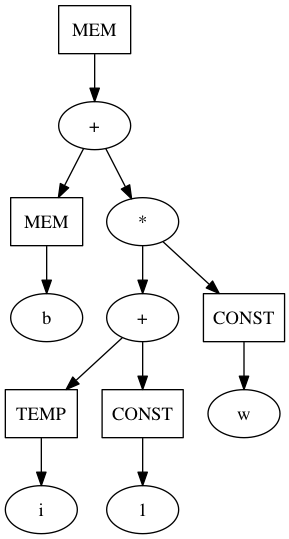
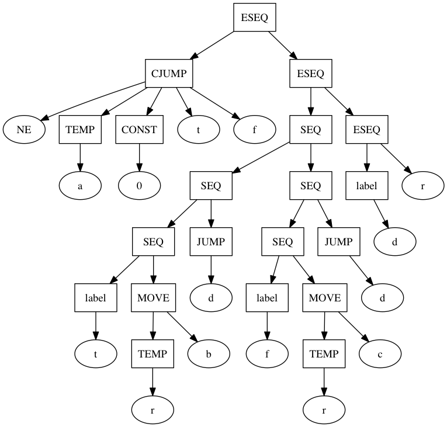
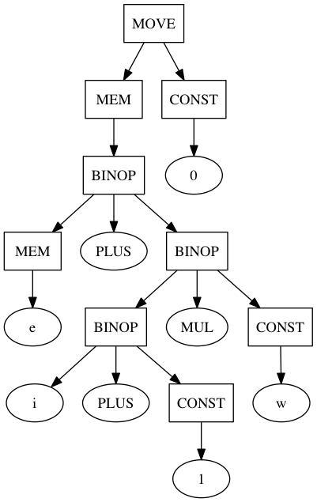

### Homework 3 

#### 13307130167 刘阳

#### 7.1

a.

 

f.

 

#### 7.2

c.

 

#### 8.1

a. `SEQ(s, MOVE(TEMP t, e))`

b. `SEQ(s, MOVE(MEM(e1), e2))`

c. if **s** and **e1** are commutable:

​	`SEQ(s, MOVE(MEM(e1), e2))`

  else:

​    `SEQ(MOVE(TEMP t, e1), SEQ(s, MOVE(MEM(TEMP t), e2)))`

#### 8.6

Basic blocks: 1 2 | 3 | 4 5 | 6 | 7 8 | 9 10 11 | 12 | 13 14 | 15

​	