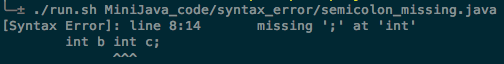

# 编译报告

13307130167 刘阳

### 一、文法工具

1. 不同工具的介绍和比较：
   - ANTLR: ANTLR提供了Lexer和Parser，一套文法描述就可以自动生成词法和句法分析代码。同时ANTLR支持ALL(*)文法，可以不用担心左递归等文法分析中常见的问题。
   - Flex/Bison, Lex/Yacc, Jlex/CUP: 对这些工具没有做过详细的调查，从另一个班的使用感受来看，这些工具都是组合来使用，也就是说词法分析是一套(Flex, Lex, Jlex)，句法分析是另一套(Bison, Yacc, CUP)。同时这些句法工具支持的大多数是LALR(1)文法，需要消除左递归。


2. 选择ANTLR的原因：

   选择ANTLR最大原动力是因为自己懒。一套工具就可以自动解决词法和句法的分析代码，何必花时间分别去学词法和句法工具。其次ANTLR支持ALL(*)文法，也就意味着我可以直接拿MiniJava的BNF当作ANTLR的文法描述，而不用再自己去消除左递归等繁琐事务。另外ANTLR的工具链已经做好了可视化的抽象语法树，可以直观地看到解析的结果。

   当然另一方面也去试用了ANTLR，主要是跟着<The Definitive ANTLR 4 Reference>(以下简称Reference)过了几个小项目代码，对Parser的Listener和Visitor机制印象深刻。从一开始ANTLR的文法表示可以内嵌代码，到职责分明、有层次感的类结构设计，都很称自己的心意。ANTLR的整个分析过程以树为结构，符合直觉，也方便跟踪和排错。使用OO语言Java作为开发语言，辅之以Java丰富的数据表示结构，也方便开发者拓展和自定义功能。

   还有一个原因，看到[ANTLR官网“小红花”页](http://www.antlr.org/testimonials.html)有Python之父Guido van Rossum的背书，作为Python粉丝，我当然还是要支持一个的。

### 二、词法/句法分析的原理

这段时间对编译的学习，也从一个小白到略知一二。对于词法/句法分析，Reference中有一段以“走迷宫”来类比阐释这个概念，我本人也深以为意。词法/句法分析都会接触到状态自动机的概念，而“走迷宫”正是状态转移的过程。

词法分析使用正则表达式，以词的每个字母为线索，来判断迷宫的下一步怎么走。以`a(b|c)d`为例，刚进迷宫时，只有看到“a”才能前进，然后看到"b"就往左走，看到"c"就往右走，最后看到"d"就汇合到迷宫的终点。更复杂的词法正则表达式只不过多了些字母集合，多了某些迷宫位置的计数等，本质上的思想还是一致的。

而句法分析也是类似的思想，只不过这时的最小单位是词法分析的结果——Token。文法定义的规则就是走迷宫的依据，这时可能会先试探性地朝前走几步（parse过程的超前查看），然后决定岔路口怎么走。

### 三、代码

1. 源代码结构：

   src目录下的文件结构如图所示。

    

2. 核心代码：

   作为编译器前端的核心代码即是`compiler_front/MiniJavaCompiler.java`，处理流程为：字符串输入流 -> 由Lexer处理成Token流 -> 由Parser处理成句法解析树 -> 使用ErrorListener机制处理错误报告 -> 使用ErrorStrategy机制改写错误处理策略 -> 使用ParserListener机制处理作用域验证。

   很多的实现都是使用了ANTLR生成的代码的默认实现，如ANTLR错误恢复的`sync-and-return strategy`机制。

   主要的工作在：

   - 翻译MiniJava的BNF，形成ANTLR的g4文法规则文件，并扩充了MiniJava语法功能；
   - 验证文法规则的正确性，输出MiniiJava示例代码的抽象语法树；
   - 实现代码编译时的错误处理功能，分为词法错误、语法错误和语义错误（下一部分细说）

3. 遇到的问题和解决思路：

   问题主要集中在文法规则的构建和错误处理上。

   - 问题：扩展MiniJava的BNF，使其支持块注释，包声明和包导入语法特性。

     解决思路：参考了Reference中一些g4文法文件的注释定义，包声明和包导入则是参照其他BNF写的。

   - 问题：词法和语法错误的自定义异常。

     解决思路：在g4文法文件中内嵌异常通知代码，同时继承`RecognitionException`异常类，自定义解析异常类。

   - 问题：语义错误中的作用域验证。

     解决思路：参照Reference中的作用域验证示例。


### 四、错误处理与修复

1. 词法错误

   词法错误主要处理了不合法变量声明错误和关键词错误。

   - 不合法变量声明错误：

     这类错误如：`int 1a;`，也就是以数字开头的变量声明。

     处理的机制是在g4文法文件中添加一条匹配不合法变量的Token规则：

     `ID: DIGIT (LETTER|DIGIT|'_')* (LETTER|'_')+`，

     然后使用内嵌代码的方式，直接输出错误：

     `{System.err.println("[Lexical Error]:\tIdentifier cannot start with number: " + getText());}`。

     截图：

     

   - 关键词错误：

     这类错误如：`pulic static void main(String[] a){`，也就是输入中有和g4文法中字符串常量不符的词。

     如上面这个错误就和这条规则的字符串常量不符：

     ```xml
     mainClass: 
     'class' ID '{'
       'public' 'static' 'void' 'main' '(' 'String' '[' ']' ID ')' '{'
         (statement)*
       '}'
     '}' ;
     ```

      处理的机制是继承`BaseErrorListener`类，构造`ErrorReporter`类，实现一个`reportKeywordMismathcException`的方法。

     由于Parser在解析过程中遇到错误会在`reportError`方法中传进`RecognitionException`类参数，而我们可以从这个类中获得产生错误的Token(通过`getOffendingToken`方法)， 以及文法规则期望的Token(通过`getExpectedTokens`方法)。所以我们可以从这个期望的Token集合中找到和错误的Token最匹配的，然后以这个最匹配的Token作为错误Token的替代，继续解析。

     寻找最匹配Token使用的标准是“编辑距离” (Levenshtein Distance)，算法使用了动态规划实现，具体的代码在`compiler_utils/LevenshteinDistance.java`中。

     截图：

     

     

2. 语法错误

   语法错误主要处理了操作数缺失错误、括号不匹配错误、保留词误用错误和分号缺失错误。

   - 操作数缺失错误：

     操作数缺失错误有如下形式：`a = a + ; b = && a;`，也就是在双目运算符的左侧或右侧缺失了操作数。

     处理的机制也是在g4文法文件中内嵌代码。在这里我继承了ANTLR的解析异常类`RecognitionException`，自定义了异常`OperandMissingException`。

     首先在g4文法文件中声明头部的包导入语句:

     ```java
     @header {
     import recognition_exceptions.*;
     }
     ```

     然后在`expressoin`规则内规定两条能够解析操作数缺失问题的规则：

     ```java
     | expression ('&&' | '<' | '+' | '-' | '*' )
        {notifyErrorListeners(this.getCurrentToken(),
           "Missing right operand",
           new OperandMissingException(this));}            #BinOpMissRight
     | ('&&' | '<' | '+' | '-' | '*' ) expression
        {notifyErrorListeners(this.getCurrentToken(),
           "Missing left operand",
           new OperandMissingException(this));}            #BinOpMissLeft
     ```

     这样在匹配到这两条替代规则时，就会触发对应的代码，通知错误监听器，报告相应的解析异常。

     具体做法是在`ErrorReporter`类中实现`errorReporter`方法，该方法根据异常的类型，执行相应的报错。

     ```java
     else if (e instanceof OperandMissingException) {
        System.err.println("[Syntax Error]: line " + line + ":" + charPositionInline + "\t" + msg);
     ```

     截图：

     

   - 括号不匹配错误：

     括号不匹配是指缺失右括号或者多了右括号，如`b = a.toString()); b = a.toString(;`。

     处理的机制和操作数缺失错误类似，也是在文法文件中内嵌代码，自定义了`ParenthesisDismatchException`异常类。

     截图：

     

   - 保留词误用错误：

     保留词误用错误是指将语法的保留词用作了其他用途，典型的是将保留词用作了变量声明，如`int true`。

     这类错误在Parser解析时会报出`InputMismatch`的异常，所以我在`ErrorReporter`类中实现了`reportInputMismatchException`的方法，用来判断关键词错误和保留词误用错误。

     另外实现`reportReservedWordMisuseException`方法，用来判断是哪一个保留词被误用了。

     截图：

     

   - 分号缺失错误：

     分号缺失错误是指表达式之间没有用分号隔开，如`int b int c; `。

     分号缺失错误在ANTLR异常类型中是一种`MissingToken`的错误，所以我继承了ANTLR的`DefaultErrorStrategy`类，实现了一个简单的`MiniJavaDefaultErrorStrategy`类，在里面覆写了`reportMissingToken`方法，用来判断是分号缺失异常(`SemicolonMissingException`)，还是其他的异常。

     ```java
     if (missing.equals("';'")) {
         recognizer.notifyErrorListeners(t, "missing " + missing + " at " + error, new 			SemicolonMissingException(recognizer));
     } else {
     	recognizer.notifyErrorListeners(t, "missing " + missing + " at " + error, 			  (RecognitionException) null);
     }
     ```

     截图：

     

3. 语义错误

   语义错误主要处理了作用域验证。

   - 作用域验证：

     得益于Reference里面的源代码，作用域验证基本使用了这份源代码，修改了几处用来匹配MiniJava的文法。

     处理的机制是两次遍历解析树，第一次用来收集对应作用域下定义的ID（包括变量和方法），第二次用来验证对应作用域下使用的ID是否已经定义了，如果没有，则报错。

     大部分同学都采用了基本相同的实现方法，在此就不赘述了。

     截图：

     

     

### 五、项目感想

先夸夸ANTLR好用吧，起码对于这个编译器的前端来讲，足够用了。而且Listener的机制很便于使用者自定义解析行为。

虽然Reference里面很多源代码对于这个编译的PJ很有帮助，但是Reference在错误报告和处理部分只讲了ANTLR的错误处理策略，而没有讲开发者可以如何自定义错误处理策略，这一点略不友善。人懒也不愿意去读`DefaultErrorStrategy`的代码实现。